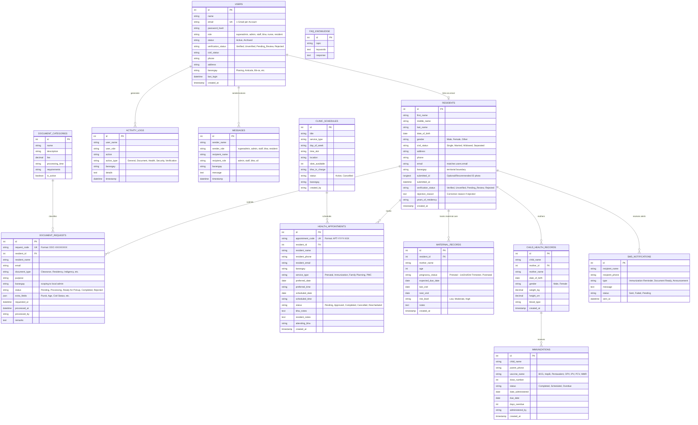
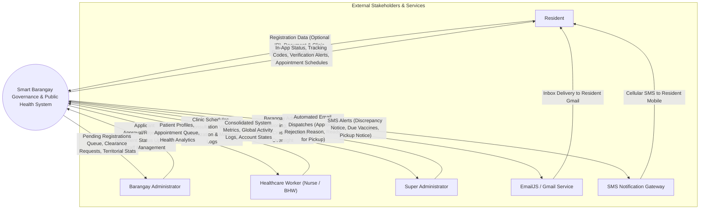
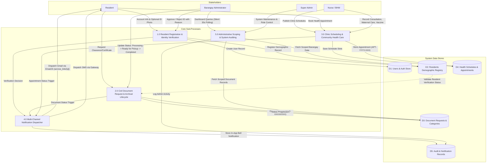
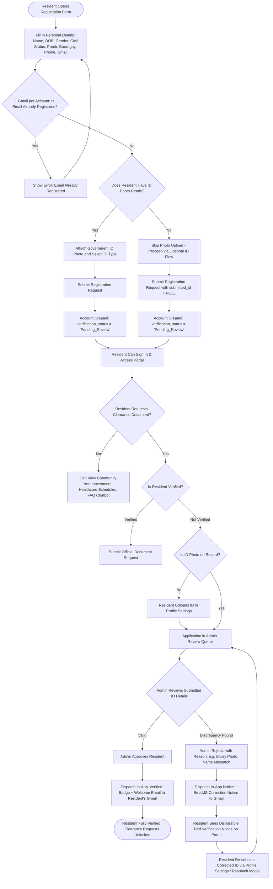
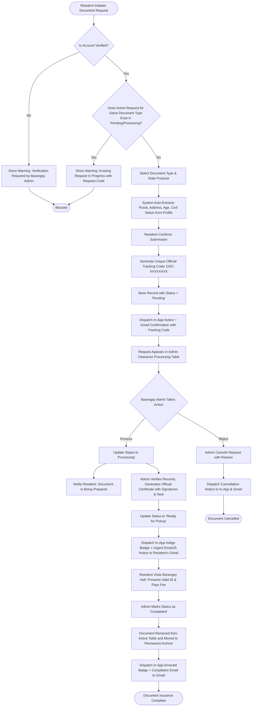
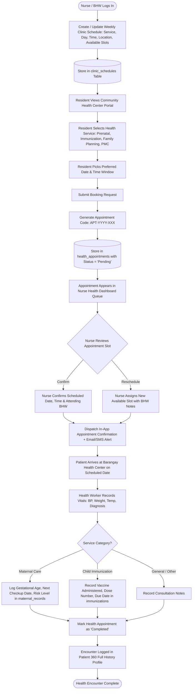
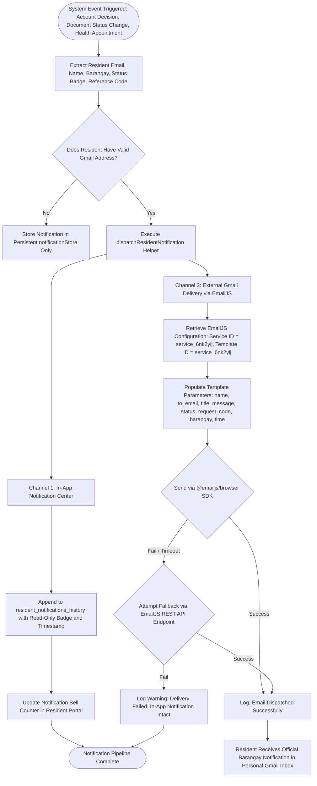

# Smart Barangay Governance & Public Health System Architecture

This document presents the complete architectural specification for the system, including the **Entity Relationship Diagram (ERD)**, **Data Flow Diagrams (DFD Level 0 & Level 1)**, **Use Case Diagram**, and **Process Flowcharts**.

---

## 1. Entity Relationship Diagram (ERD)

The following diagram illustrates the relational data model of the MySQL database (`smart_db`), including primary keys (`PK`), foreign keys (`FK`), and entity cardinalities.

---

## 2. Data Flow Diagrams (DFD)

### 2.1 Context Level 0 DFD (System Boundary)

---

### 2.2 Level 1 DFD (Decomposed Sub-Processes)

---

## 3. Use Case Diagram

```mermaid
graph LR
    subgraph Actors["System Actors"]
        R(("Resident"))
        BA(("Barangay Admin"))
        BHW(("Nurse / BHW"))
        SA(("Super Admin"))
    end

    subgraph Portal_Resident["Resident Portal"]
        UC1["Create Account (Optional ID)"]
        UC2["Sign In (1 Gmail Account)"]
        UC3["Upload / Remove ID in Profile"]
        UC4["Submit Document Request"]
        UC5["Track Document Status"]
        UC6["Book Clinic Appointment"]
        UC7["View Maternal & Vaccine Records"]
        UC8["View Read-Only In-App Notifications"]
        UC9["Receive Gmail & SMS Alerts"]
        UC10["Consult FAQ Chatbot"]
    end

    subgraph Portal_Admin["Barangay Admin Portal"]
        UC11["Review Pending Resident Registrations"]
        UC12["Approve Resident Verification"]
        UC13["Reject Applicant with Specific Discrepancy Reason"]
        UC14["Process Document (Pending -> Processing -> Ready -> Completed)"]
        UC15["Archive Claimed Documents"]
        UC16["Manage Staff & BHW Accounts"]
        UC17["View Scoped Barangay Analytics & Reports"]
        UC18["Send Broadcast / Notice SMS"]
    end

    subgraph Portal_Health["Health Center Portal"]
        UC19["Publish Clinic Schedules"]
        UC20["Confirm / Reschedule Appointments"]
        UC21["Record Consultation Vitals & Diagnoses"]
        UC22["Manage Maternal Care Records"]
        UC23["Log Child Immunization Administered"]
        UC24["Track Vaccine Inventory"]
    end

    subgraph Portal_SuperAdmin["Super Administrator"]
        UC25["Cross-Barangay Executive Oversight"]
        UC26["Enforce 1 Admin Per Barangay Rule"]
        UC27["Audit Global System Activity Logs"]
        UC28["Soft-Delete / Restore Accounts"]
    end

    %% Resident Connections
    R --> UC1
    R --> UC2
    R --> UC3
    R --> UC4
    R --> UC5
    R --> UC6
    R --> UC7
    R --> UC8
    R --> UC9
    R --> UC10

    %% Barangay Admin Connections
    BA --> UC2
    BA --> UC11
    BA --> UC12
    BA --> UC13
    BA --> UC14
    BA --> UC15
    BA --> UC16
    BA --> UC17
    BA --> UC18

    %% Health Worker Connections
    BHW --> UC2
    BHW --> UC19
    BHW --> UC20
    BHW --> UC21
    BHW --> UC22
    BHW --> UC23
    BHW --> UC24

    %% Super Admin Connections
    SA --> UC2
    SA --> UC25
    SA --> UC26
    SA --> UC27
    SA --> UC28
```

---

## 4. System Flowcharts

### 4.1 Flowchart 1: Resident Registration & Civic Verification (with Optional ID Flow)

---

### 4.2 Flowchart 2: Civil Document Request & Archival Lifecycle

---

### 4.3 Flowchart 3: Health Center Appointment & Clinic Scheduling Flow

---

### 4.4 Flowchart 4: Dual-Channel Notification & Gmail Pipeline

